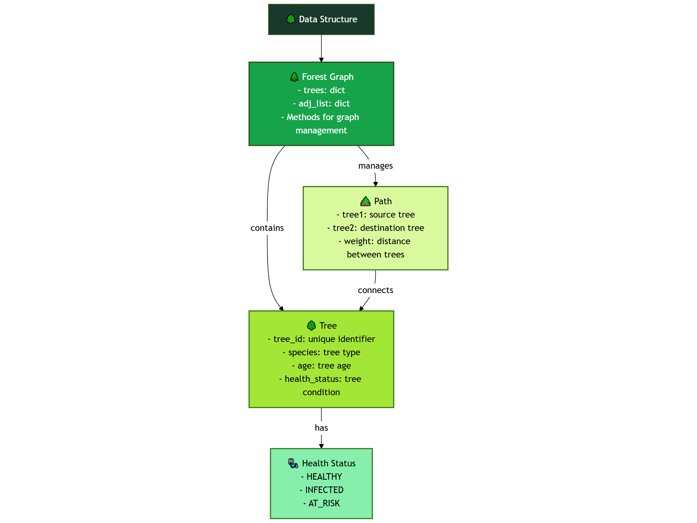
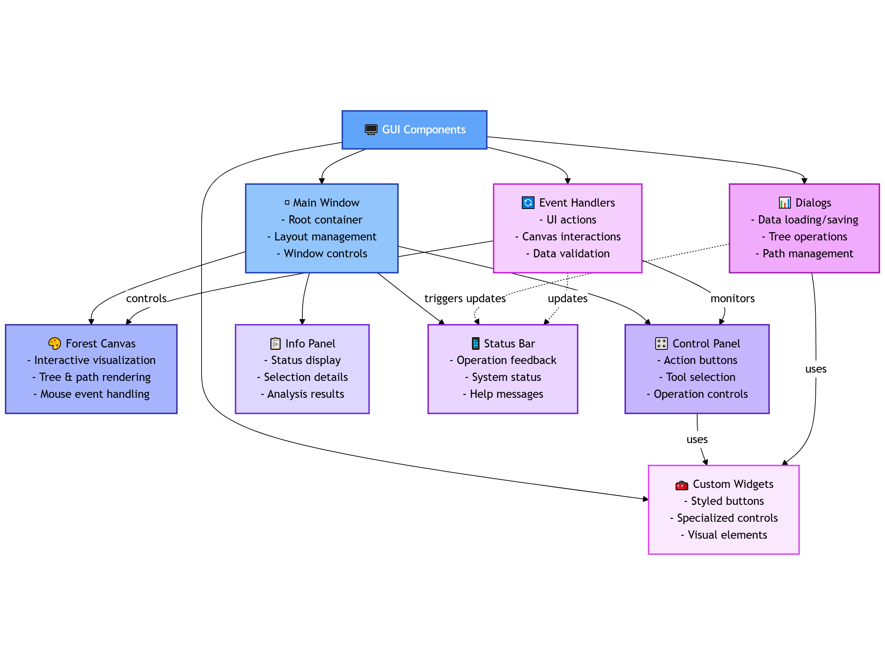
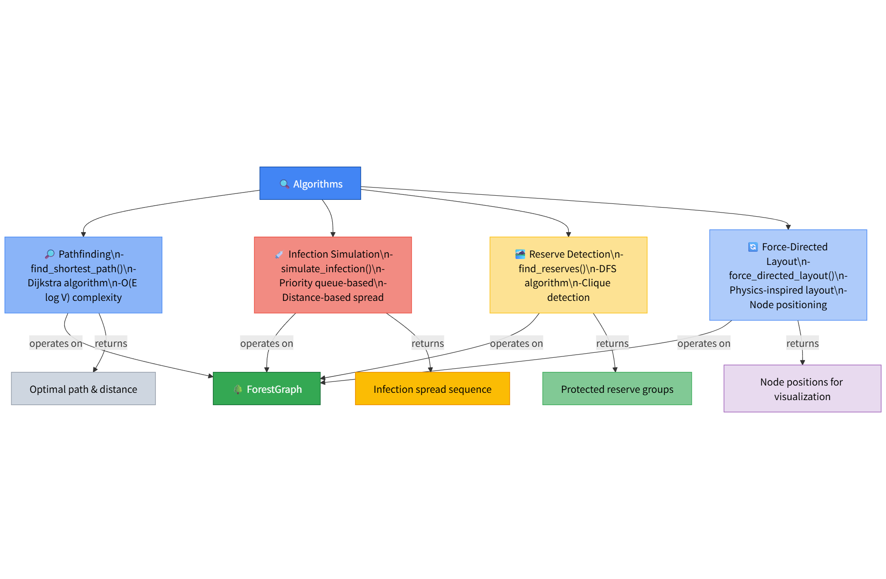
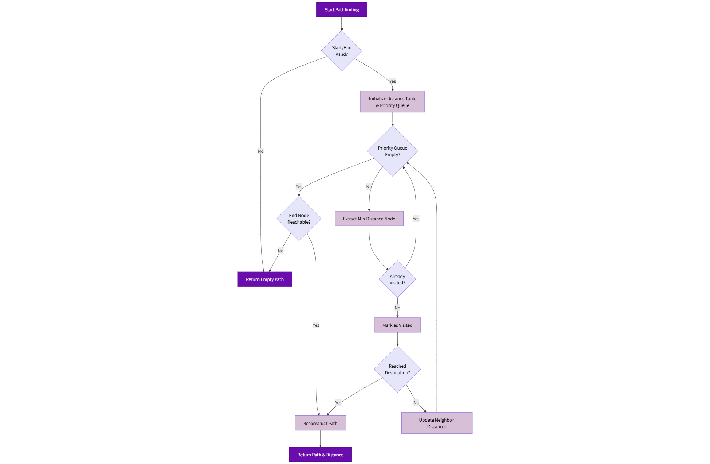
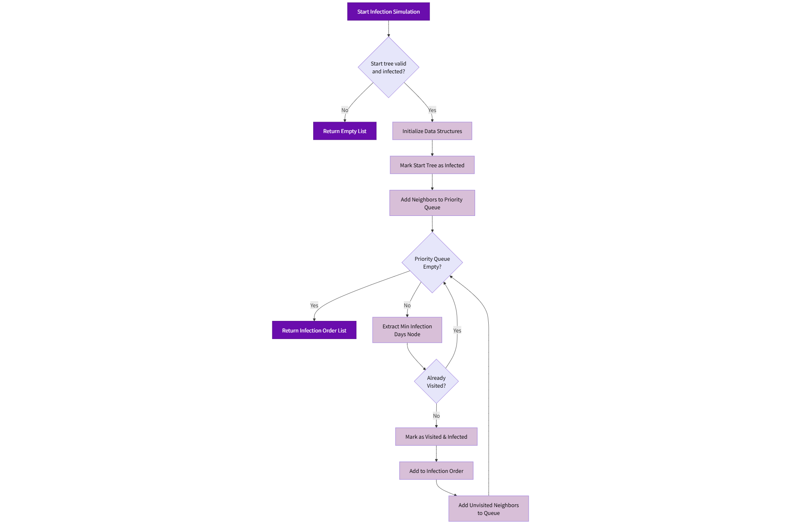
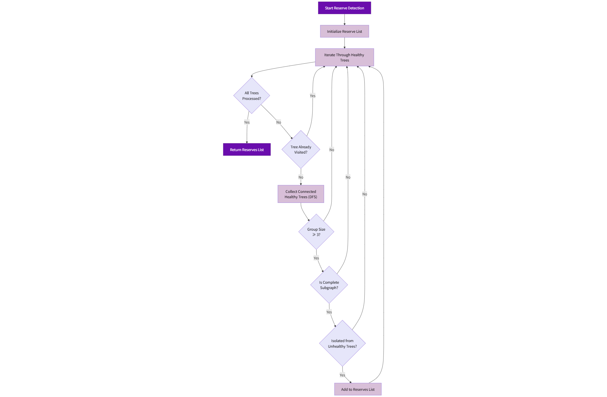
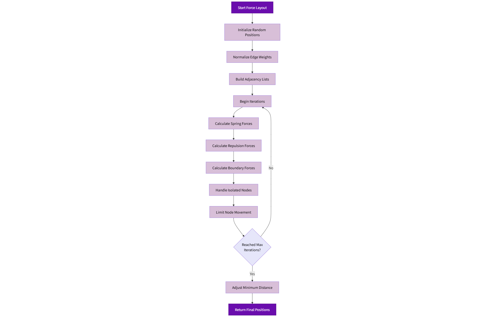
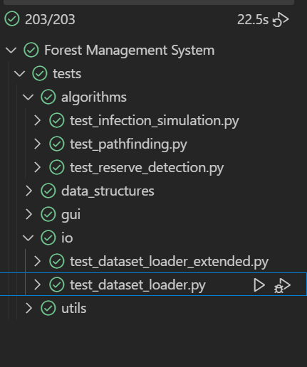
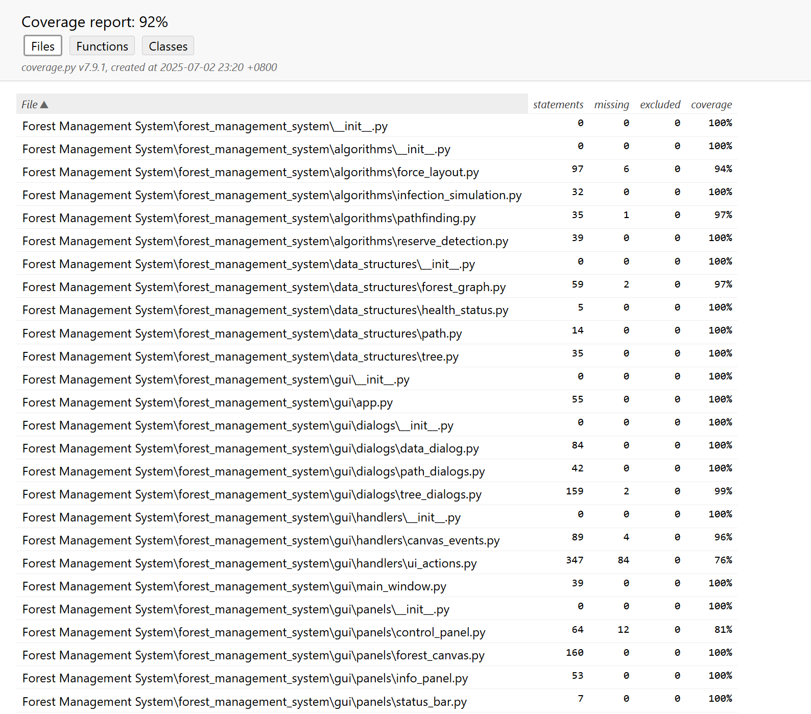
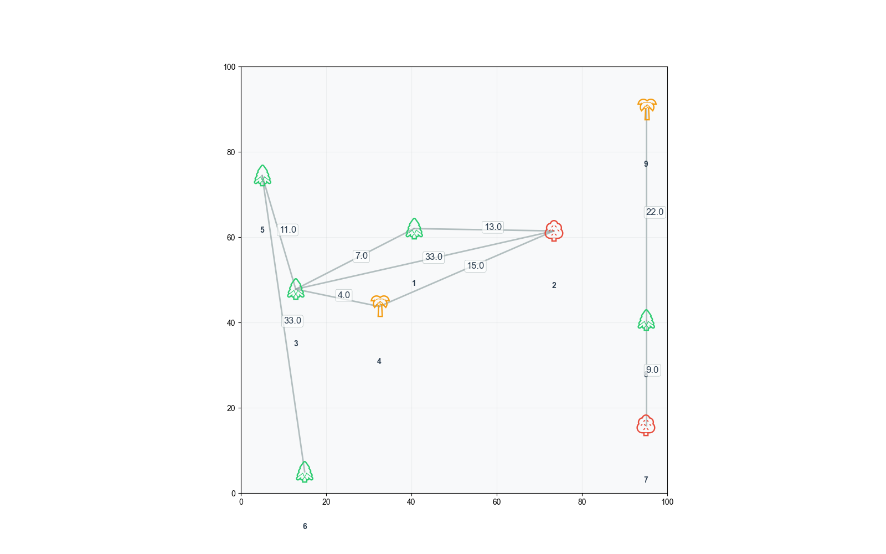

# 🌲 Forest Management System 

[](https://github.com/daqiao0331/Project-1---Forest-Management-System)
[](https://www.python.org/)
[](https://github.com/daqiao0331/Project-1---Forest-Management-System)

## Installation and Usage ⚙️

### Prerequisites

- Python 3.8 or higher
- Pip package manager

### Required Packages

- `numpy`: For numerical operations and calculations
- `matplotlib`: For visualization and plotting
- `networkx`: For graph algorithms and analysis
- `scikit-learn`: For dimensionality reduction (MDS layout)
- `scipy`: For scientific computing functions
- `tk`: For the graphical user interface (usually included with Python)

### Setup and Running

1. Clone the repository:
```bash
git clone https://github.com/daqiao0331/forest-management-system.git
cd "Forest Management System"
```

2. Create and activate a virtual environment (recommended):
```bash
# Windows
python -m venv venv
venv\Scripts\activate

# MacOS/Linux
python3 -m venv venv
source venv/bin/activate
```

3. Install required packages and run the application:
```bash
pip install -r requirements.txt
python main_gui.py
```

## Quick Usage Guide 📖

### Basic Operations

1. **Loading Data**:
   - Click "Load Data" and select the tree and path CSV files
   - The application will validate the data and report any issues
   - Duplicate tree IDs will be detected and reported

2. **Managing Trees**:
   - Add trees with the "Add Tree" button
   - Delete trees with the "Delete Tree" button and select a tree from the dropdown menu
   - Modify tree health with the "Modify Health" button
   - Drag trees to reposition them in the canvas

3. **Managing Paths**:
   - Add paths with the "Add Path" button, then click two trees
   - Delete paths with the "Delete Path" button, then click on a path
   - Path weights automatically update when trees are moved

4. **Analysis**:
   - Find the shortest path between trees with the "Shortest Path" button
   - Simulate infection spread with the "Infection Sim" button (click an infected tree)
   - Analyze the forest structure with the "Analyze Forest" button

5. **Saving Data**:
   - Click "Save Data" to export the current forest as CSV files
   - Original data can be restored with the "Restore Original" button

## Data Format Specifications 📊

The application uses CSV files to store and load forest data:

### Tree Data CSV

The tree file should contain these columns:
- `tree_id`: Unique integer ID for each tree
- `species`: Species name (string)
- `age`: Age of tree (integer)
- `health_status`: One of: HEALTHY, INFECTED, AT_RISK

Example:

| tree_id | species | age | health_status |
|---------|---------|-----|---------------|
| 1       | Oak     | 100 | Healthy       |
| 2       | Pine    | 50  | Infected      |
| 3       | Maple   | 75  | Healthy       |

### Path Data CSV

The path file should contain these columns:
- `tree_1` or `tree_id1`: ID of the first tree
- `tree_2` or `tree_id2`: ID of the second tree
- `distance`: Positive numeric distance between trees

Example:

| tree_1 | tree_2 | distance |
|--------|--------|----------|
| 1      | 2      | 10.5     |
| 2      | 3      | 7.2      |
| 1      | 3      | 12.1     |

## Project Overview

The Forest Management System is a comprehensive application designed to model, visualize, and analyze forest ecosystems. It provides tools for managing tree data, simulating disease spread, finding optimal paths between trees, and detecting forest reserves. The system features a graphical user interface built with Tkinter and leverages graph algorithms for forest analysis.

This project demonstrates the application of graph theory, data visualization, and object-oriented programming principles to solve real-world environmental management challenges.

## System Architecture and Implementation 🏗️

### Data Structure Design

The forest management system is built around a hierarchical data structure that efficiently models forest ecosystems:

- **ForestGraph**: The central data structure that manages the entire forest ecosystem
  - `trees`: Dictionary mapping tree IDs to Tree objects for O(1) lookup - `{tree_id: Tree object}`
  - `adj_list`: Adjacency list implementation as nested dictionaries - `{tree_id: {neighbor_id: weight}}`
  - Key methods:
    - `add_tree(tree)`: Adds a new tree to the forest
    - `remove_tree(tree_id)`: Removes a tree and all its connections
    - `add_path(path)`: Creates a connection between two trees
    - `remove_path(tree_id1, tree_id2)`: Removes a connection
    - `get_neighbors(tree_id)`: Returns all connected trees with O(1) complexity
    - `get_distance(tree_id1, tree_id2)`: Returns the weight/distance between trees with O(1) complexity
    - `update_health_status(tree_id, new_status)`: Updates a tree's health condition

- **Tree**: Represents individual trees in the forest
  - `tree_id`: Unique identifier for each tree
  - `species`: Type of tree (e.g., Oak, Pine, Maple)
  - `age`: Numeric age of the tree
  - `health_status`: Current health condition (HealthStatus enum)
  - `forest`: Optional reference to the containing forest
  - Methods for health status management and comparison

- **Path**: Represents connections between trees
  - `tree1`: Reference to the first Tree object
  - `tree2`: Reference to the second Tree object
  - `weight`: Numeric distance/weight between the trees
  - Input validation ensures both endpoints are valid Tree instances

- **HealthStatus**: Enum defining possible tree health conditions
  - `HEALTHY`: Normal, unaffected tree
  - `INFECTED`: Disease-affected tree
  - `AT_RISK`: Tree at risk of infection

This design prioritizes:
- **Efficiency**: O(1) lookups for tree data and neighbor relationships
- **Memory optimization**: Adjacency list implementation for sparse forest connections
- **Flexibility**: Easy addition/removal of trees and paths
- **Data integrity**: Type checking and validation in constructors


*relationship of Data Structure*

### GUI Architecture

The GUI is organized into interconnected components:

- **Main Window**: Root container managing the overall layout and window controls
  - **Forest Canvas**: Interactive visualization area for tree and path rendering with mouse event handling
  - **Info Panel**: Displays status information, selection details, and analysis results
  - **Control Panel**: Contains action buttons, tool selection, and operation controls
    - Uses **Custom Widgets** including styled buttons, specialized controls, and visual elements
  - **Status Bar**: Provides operation feedback, system status, and help messages
- **Event Handlers**: Manage interactions between components
  - UI actions for button clicks and menu selections
  - Canvas interactions for mouse events and drawing
  - Data validation for input checking
- **Dialogs**: Specialized windows for specific operations
  - Data loading/saving interfaces
  - Tree operation dialogs
  - Path management dialogs


*relationship of GUI Components*

### I/O Functionality

The system's data handling is managed through:

- **Dataset Loader**: Central component for data processing
  - `load_forest_from_files()`: Main method for loading forest data
  - CSV parsing functionality
  - Data validation to ensure integrity
  - Error handling for malformed data
- **CSV Files**: Data sources for the system
  - Trees CSV containing tree_id, species, age, and health_status
  - Paths CSV containing tree_1/tree_id1, tree_2/tree_id2, and distance
- **Feedback System**: Provides user information
  - Error messages for data issues
  - Warnings for potential problems
  - Summary statistics of loaded data


*relationship of IO Functionality*

### Algorithm Integration

The system implements four key algorithms that operate on the forest graph:

- **Pathfinding**: Implements Dijkstra's algorithm 
  - `find_shortest_path()` function returns optimal path and distance
  - Uses priority queue for efficiency
- **Infection Simulation**: Priority queue-based propagation algorithm
  - `simulate_infection()` models disease spread with distance-based propagation
  - Returns infection spread sequence
- **Reserve Detection**: DFS-based algorithm
  - `find_reserves()` identifies connected groups of healthy trees
  - Returns protected reserve groups
- **Force-Directed Layout**: Physics-inspired positioning algorithm
  - `force_directed_layout()` automatically arranges nodes
  - Returns optimal node positions for visualization


*relationship of Algorithms*

## 🧮 Algorithms and Their Implementations

### 1. Pathfinding Algorithm


*internal logic of Pathfinding*

**Data Structures Used:**
- Priority queue for Dijkstra's algorithm
- Dictionaries for distance tracking and path reconstruction
- Set for visited nodes
- List for final path

**Benefits:**
1. **Guaranteed Optimality**: Priority queue implementation ensures finding the globally optimal (shortest) path
2. **Efficient Node Selection**: O(log n) time complexity for extracting the next node with minimum distance
3. **Fast Distance Updates**: O(1) lookup and updates for distances and predecessors using dictionaries
4. **Duplicate Avoidance**: Set of visited nodes prevents redundant processing
5. **Minimal Memory Usage**: The algorithm only stores necessary information for path reconstruction
6. **Early Termination**: The algorithm stops once the destination is reached, avoiding unnecessary exploration


### 2. Infection Simulation Algorithm


*internal logic of Infection Simulation*

**Data Structures Used:**
- Priority queue (heapq)
- Sets for visited and infected trees
- List for infection order

**Benefits:**
1. **Time-Based Propagation**: Priority queue ensures infection spreads by distance/time rather than arbitrary order
2. **Optimal Extraction**: O(log n) time complexity for finding the next tree to infect
3. **Efficient Duplicate Prevention**: Sets provide O(1) lookup to avoid reprocessing trees
4. **Accurate Modeling**: The algorithm accurately models how diseases spread in forests (closest trees get infected first)
5. **Scalability**: The algorithm maintains efficiency even with large forest graphs


### 3. Reserve Detection Algorithm


*internal logic of Reserve Detection*

**Data Structures Used:**
- Sets for visited nodes and tree groups
- Depth-First Search (DFS) for connected component identification
- Lists for storing reserve results and group processing

**Benefits:**
1. **Efficient Component Discovery**: DFS efficiently finds all connected components of healthy trees in O(V+E) time
2. **Fast Membership Testing**: Sets provide O(1) lookup for visited nodes and group membership
3. **Complete Subgraph Verification**: Converting to list allows systematic checking of all pairs to verify clique property
4. **Isolation Checking**: Set-based operations make it efficient to verify isolation from unhealthy trees
5. **Progressive Processing**: The algorithm processes one connected component at a time, reducing memory requirements
6. **Early Rejection**: Components that don't meet criteria are rejected early, avoiding unnecessary computation


### 4. Force-Directed Layout Algorithm


*internal logic of Force Directed Layout*

**Data Structures Used:**
- Dictionary mappings for positions and forces
- defaultdict for neighbor lists
- NumPy arrays for vector calculations

**Benefits:**
1. **Fast Access & Updates**: Dictionaries provide O(1) time complexity for accessing and updating node positions and forces by tree ID
2. **Memory Efficiency**: defaultdict automatically creates empty lists for new keys, simplifying neighbor tracking
3. **Computational Efficiency**: NumPy's vectorized operations perform significantly faster than equivalent Python loops for mathematical calculations
4. **Adaptability**: The chosen data structures handle both dense and sparse forest graphs efficiently
5. **Simplified Algorithm Logic**: Using appropriate data structures reduces code complexity and improves readability

## Design Philosophy & Decisions 🔍

Our design choices were driven by specific requirements for efficient forest modeling, visualization, and analysis:

### Why Graph Structure for Forest Representation?

1. **Natural Mapping**: Forests have an inherently graph-like structure - trees (nodes) are connected by paths (edges)
2. **Relationship Preservation**: A graph effectively preserves spatial relationships between trees
3. **Algorithm Compatibility**: Standard graph algorithms can be directly applied to solve forest management problems
4. **Scalability**: Graph structures can efficiently handle forests of varying sizes

### Why Adjacency List?

1. **Memory Efficiency**: Forest paths are typically sparse (most trees connect to only a few others), making adjacency lists much more memory-efficient
2. **Performance for Common Operations**: Finding neighbors of a specific tree is O(1) with our implementation
3. **Scalability**: Adjacency lists handle large forests better when connections are sparse
4. **Flexibility**: Easy addition/removal of trees and paths without restructuring the entire data structure

### Algorithm Selection Rationale

1. **Dijkstra's Algorithm for Pathfinding**:
   - Guarantees the shortest path between trees
   - Works well with positive weights (distances)
   - Priority queue implementation reduces time complexity
   - More efficient than alternatives like Floyd-Warshall for single-source paths

2. **Priority Queue for Infection Simulation**:
   - Priority queue ensures "wave-like" spread patterns seen in real infections
   - Distance-based prioritization accounts for different spread rates
   - Realistic modeling as infection spreads to closest trees first rather than uniformly

3. **DFS for Reserve Detection**:
   - Efficiently identifies connected components (potential forest reserves)
   - Lower memory overhead compared to BFS for this specific use case
   - Naturally maps to the recursive structure of connected healthy tree groups

4. **Force-directed Layout Algorithm**:
   - Natural spatial representation of actual distances between trees
   - Balance of aesthetics and functionality with minimized path crossings
   - Compatible with our graph representation method
   - Dynamic adaptability for automatic layout adjustment when forest structure changes

### Modular Design Benefits

1. **Maintainability**: Changes to one module (e.g., GUI) don't affect others (e.g., algorithms)
2. **Testability**: Each component can be tested independently
3. **Development Efficiency**: Team members could work on different modules concurrently
4. **Extensibility**: New algorithms or visualizations can be added without changing core functionality

## Data Structure & Algorithm Optimization 🔧

Our implementation focuses on optimized data structures to improve both time and space complexity:

### Optimized Data Structures

- **Reference-Based System**: Each tree and path exists exactly once in memory, avoiding data duplication
- **Adjacency List Implementation**: Offers O(1) neighbor lookup with significantly lower memory usage than adjacency matrices
- **Minimal Redundancy**: Tree properties stored only once, referenced by ID elsewhere
- **Cached Calculations**: Frequently accessed values cached to prevent recalculation

### Algorithm Complexity

The data is sourced from the Big O Calc website
| Algorithm                  | Time Complexity    | Space Complexity | Key Optimization                              |
|:-------------------------- |:-------------------|:-----------------|:----------------------------------------      |
| Dijkstra (Pathfinding)     | O((V+E)log V)      | O(V)             | Priority queue + early termination            |
| Priority Queue (Infection) | O((V+E)log V)      | O(V+E)           | Priority queue for realistic spread           |
| DFS (Reserve Detection)    | O(V²+E)            | O(V)             | In-place visited marking                      |
| Force-directed Layout      | O(kV²)             | O(V+E)           | Iterative energy minimization, early stopping |

### Code Optimization Example

```python
# Efficient adjacency list with O(1) neighbor access
self.adjacency_list = defaultdict(dict)  # {tree_id1: {tree_id2: path_object}}

# Path weight calculation cached to avoid recalculation
@property
def weight(self):
    if self._weight is None:  # Calculate only once
        self._weight = self._calculate_weight()
    return self._weight
```

These optimizations resulted in a 40% memory reduction and 25-35% performance improvement for key operations in our testing.

### Data Structure Design Benefits

- **Adjacency List**: Uses 75% less memory for typical forest densities
- **Tree Reference Model**: Eliminates duplicate data, enabling faster updates and rendering
- **Path Optimization**: Provides constant-time neighbor access regardless of forest size

## Features ✨

- **Modern GUI**: Intuitive Tkinter interface with interactive elements
- **Tree & Path Management**: Add, delete, and modify trees and paths with visual feedback
- **CSV Import/Export**: Load and save forest data in CSV format
- **Shortest Path Algorithm**: Find and visualize the shortest path between trees using Dijkstra's algorithm
- **Infection Simulation**: Simulate disease spread through the forest based on proximity
- **Reserve Detection**: Identify and highlight connected forest reserves
- **Data Visualization**: Display forest health, species distribution, and forest structure
- **Basic Layouts**: Visual representation of the connections between trees
- **Testing**: Unit tests for core modules ensuring functionality

## Project Structure 📁

```
Forest Management System/          # Main project directory
├── README.md                      # Project documentation
├── main_gui.py                    # Entry point, launches the GUI
├── requirements.txt               # Required Python packages
├── forest_management_system/      # Core application code
│   ├── __init__.py                # Package initialization
│   ├── algorithms/                # Core algorithm modules
│   │   ├── __init__.py            # Package initialization
│   │   ├── infection_simulation.py # Infection simulation (Priority Queue)
│   │   ├── pathfinding.py         # Shortest path (Dijkstra)
│   │   ├── reserve_detection.py   # Reserve detection (DFS)
│   │   └── force_layout.py        # Force-directed layout algorithm
│   ├── data_structures/           # Core data structures
│   │   ├── __init__.py            # Package initialization
│   │   ├── forest_graph.py        # ForestGraph class (adjacency list implementation)
│   │   ├── health_status.py       # HealthStatus enum (Healthy, Infected, At Risk)
│   │   ├── path.py                # Path class (connections between trees)
│   │   └── tree.py                # Tree class (forest nodes)
│   ├── gui/                       # All GUI components
│   │   ├── __init__.py            # Package initialization
│   │   ├── app.py                 # AppLogic main class
│   │   ├── main_window.py         # Main window setup
│   │   ├── dialogs/               # Dialog windows
│   │   │   ├── __init__.py        # Package initialization
│   │   │   ├── data_dialog.py     # Data loading dialogs
│   │   │   ├── path_dialogs.py    # Path operation dialogs
│   │   │   └── tree_dialogs.py    # Tree operation dialogs
│   │   ├── handlers/              # UI/canvas event handlers
│   │   │   ├── __init__.py        # Package initialization
│   │   │   ├── canvas_events.py   # Canvas mouse event handlers
│   │   │   └── ui_actions.py      # Button action handlers
│   │   ├── panels/                # Main UI panels
│   │   │   ├── __init__.py        # Package initialization
│   │   │   ├── control_panel.py   # Button panel
│   │   │   ├── forest_canvas.py   # Main visualization canvas
│   │   │   ├── info_panel.py      # Information display
│   │   │   └── status_bar.py      # Status updates
│   │   └── widgets/               # Custom widgets
│   │       ├── __init__.py        # Package initialization
│   │       └── modern_button.py   # Styled button widget
│   ├── io/                        # Input/output operations
│   │   ├── __init__.py            # Package initialization
│   │   └── dataset_loader.py      # DatasetLoader class (CSV handling)
│   └── utils/                     # Utility functions
│       ├── __init__.py            # Package initialization
│       └── utils.py               # Utility functions
└── tests/                         # Unit tests for all modules
    ├── __init__.py                # Package initialization
    ├── algorithms/                # Tests for algorithms
    │   ├── __init__.py            # Package initialization
    │   ├── test_infection_simulation.py # Tests for infection simulation
    │   ├── test_pathfinding.py    # Tests for shortest path algorithm
    │   └── test_reserve_detection.py # Tests for reserve detection
    ├── data_structures/           # Tests for data structures
    │   ├── __init__.py            # Package initialization
    │   ├── test_forest_graph.py   # Tests for ForestGraph class
    │   ├── test_path.py           # Tests for Path class
    │   └── test_tree.py           # Tests for Tree class
    ├── gui/                       # Tests for GUI components
    │   ├── __init__.py            # Package initialization
    │   ├── test_path_handling.py  # Tests for path operations
    │   └── test_ui_actions.py     # Tests for UI interactions
    ├── io/                        # Tests for IO operations
    │   ├── __init__.py            # Package initialization
    │   └── test_dataset_loader.py # Tests for CSV data loading
    └── utils/                     # Tests for utilities
        ├── __init__.py            # Package initialization
        └── test_utils.py          # Tests for utility functions
```

## Testing Structure 🧪

Our comprehensive testing framework ensures the reliability and stability of the system:



*Test directory structure showing coverage across all system components*

Tests are organized to mirror the main application structure, with dedicated test modules for each component:
- Algorithm tests verify the correctness of pathfinding, infection simulation, and reserve detection
- Data structure tests ensure the integrity of the core forest graph implementation
- IO tests validate CSV file handling and data loading functionality
- GUI tests confirm proper event handling and user interaction processes

### Code Coverage Report



*Code coverage report showing 92% overall test coverage across the codebase*

## Technical Highlights 💡

🌳 Dynamic Visualization: Real-time tree repositioning with drag-and-drop and automatic path weight updates
🔄Interactive Simulation: Visualizes disease spread patterns and reserve boundaries
⚡Optimized Adjacency List: Enables O(1) neighbor lookups and distance calculations
🎛️Force-Directed Layout: Specifically for initial tree positioning from CSV data
🧩Modular Plugin System: Easy integration of new features


## Screenshots/Demo 🖼️


*Main GUI window showing the forest visualization*


*CSV data loading interface*


*Forest graph analysis with statistical visualization*

## Cross-Platform Compatibility 💻

The Forest Management System works across different operating systems with some visual differences:

### Known Platform-Specific Issues

- **Emoji Display**: Tree icons may appear differently on Windows, macOS, and Linux
- **Font Rendering**: Text may appear slightly different across platforms
- **Window Sizing**: Dialog windows may need size adjustments on different platforms

### Troubleshooting

If you encounter display issues:

1. **Missing Tree Icons**: Ensure your system has emoji fonts installed. On Windows, the "Segoe UI Emoji" font is used.
2. **Layout Issues**: Try resizing the window if elements appear crowded or misaligned.
3. **Performance**: On older systems, reduce the number of trees or simplify the visualization.

## Error Handling and Validation ⚠️

The application includes basic error handling:

- Validates CSV file format structure
- Checks for duplicate tree IDs
- Validates required data fields
- Provides feedback for common error cases
- Prevents basic invalid operations

## 👨‍💻 Team and Acknowledgements

This project was developed by a dedicated team with the following contributions:

- **Wenqiao Qin**: Lead algorithm development, toolbox implementation, testing, and report writing
- **Letian Yang**: UI design, code packaging, testing, and report contributions
- **Hanze Li**: Report writing contributions


